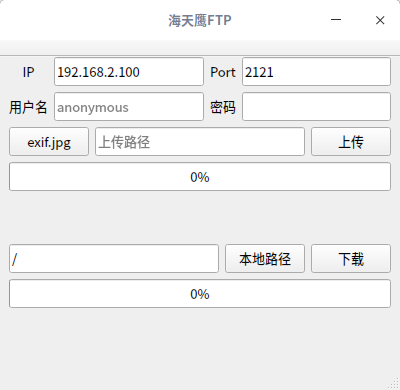

# HTYFTP
A simple FTP client based on Qt and https://blog.csdn.net/u014746838/article/details/81809288.   
The file HTYFTP is compiled on 64 bit Linux Qt5.10.1.  

## References
[FtpManager](https://blog.csdn.net/u014746838/article/details/81809288)

## 使用场景
[配合安卓服务器端可以在手机和电脑之间传文件](https://github.com/sonichy/FTPServe_Android)